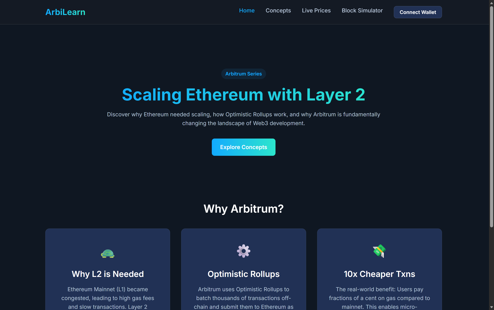
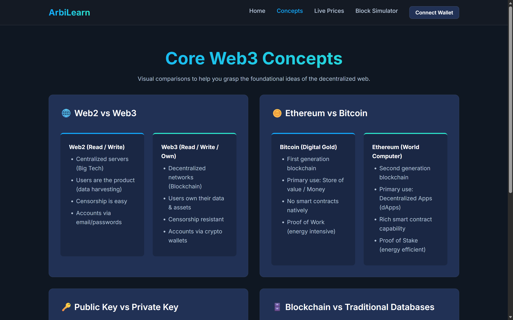
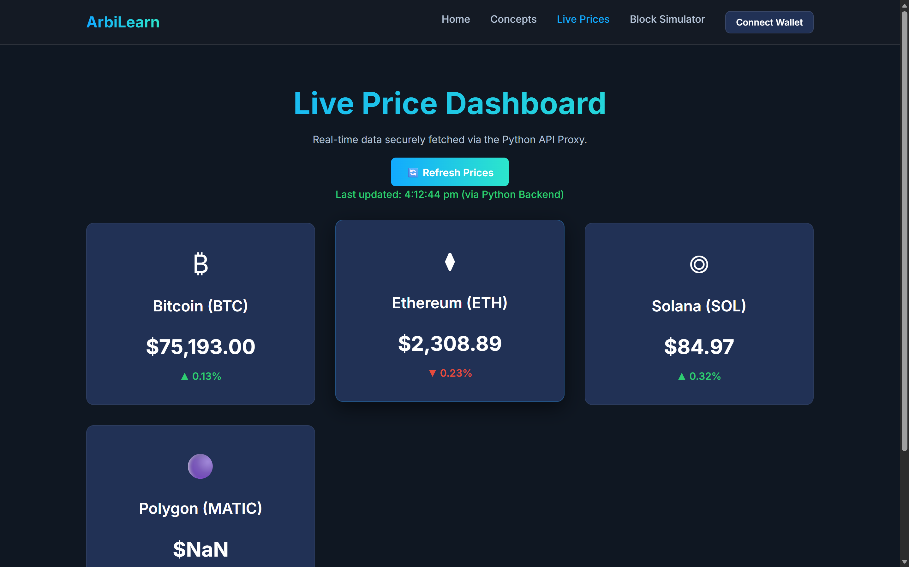
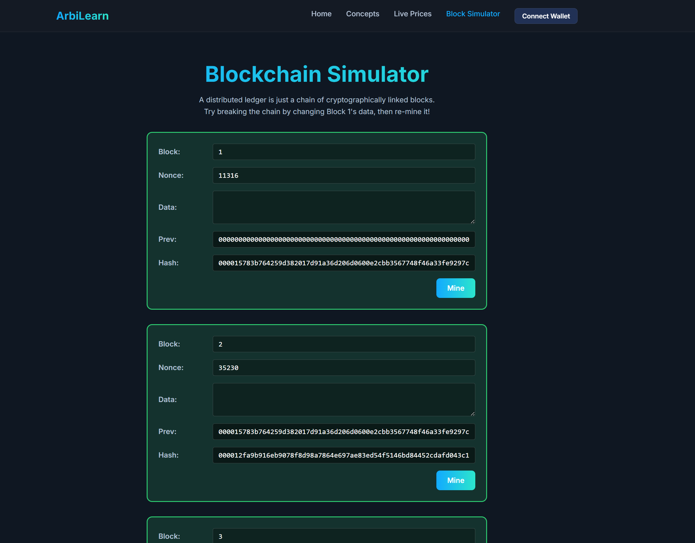

# ArbiLearn | Web3 Full-Stack Demo (Python Edition)

## Description
ArbiLearn is a 4-page responsive Web3 website built as part of the LamprosDAO Arbitrum Builder Pods assignment. It is designed to teach foundational Web3 and Layer 2 concepts through real-world examples, live data integration, and an interactive blockchain simulator.

Following architectural upgrades, the project is structured as a **Full-Stack Application** powered by **Python (Flask)**. It utilizes the official Arbitrum Brand Kit design system and securely connects to Web3 via Ethers.js.

## Project Structure (4 Pages)
This cohesive website includes four individual HTML pages linked together via a centralized Jinja2 `base.html` template:

1. **Home / Landing (`/`)**
   
   Introduces the need for Layer 2 scaling, Optimistic Rollups, and the real-world benefits of using Arbitrum over Ethereum Mainnet. Connect your MetaMask Vault directly from the navigation bar on this page.

2. **Concepts (`/concepts`)**
   
   Visual layout (card-based comparisons) explaining the difference between Web2 vs Web3, Ethereum vs Bitcoin, Public vs Private Keys, and Blockchains vs Traditional Databases.

3. **Live Prices (`/prices`)**
   
   A dynamic dashboard using a server-side Python proxy to fetch and render live prices for BTC, ETH, SOL, and MATIC via CoinGecko. The Python backend resolves browser CORS issues and handles endpoint Rate-limiting gracefully with cached fallbacks.

4. **Block Simulator (`/simulator`)**
   
   An interactive proof-of-work simulator visually mirroring the famous Anders Brownworth demo. It features sequential blocks dynamically altering their cryptographic SHA-256 hashes based on Nonce iteration and Data changes. 

## How to Install & Run Locally
This project uses **Python (Flask)** for its core backend routing and template compilation.

### Prerequisites
- Python 3.x Installed
- pip Installed

### Installation
1. Clone or download this repository.
2. Navigate to the project folder.
3. Install the minimal backend dependencies:
   ```bash
   pip install Flask requests
   ```
4. Start the server:
   ```bash
   python app.py
   ```
5. Open your browser and navigate to `http://localhost:5000`

## Tech Stack
- Backend: Python 3.x, Flask, Requests
- Frontend: HTML5, CSS3 
- Web3: Ethers.js, MetaMask extension window (`window.ethereum`)

## Built By
- Devasya Patel
- Arbitrum Builder Pods 2
